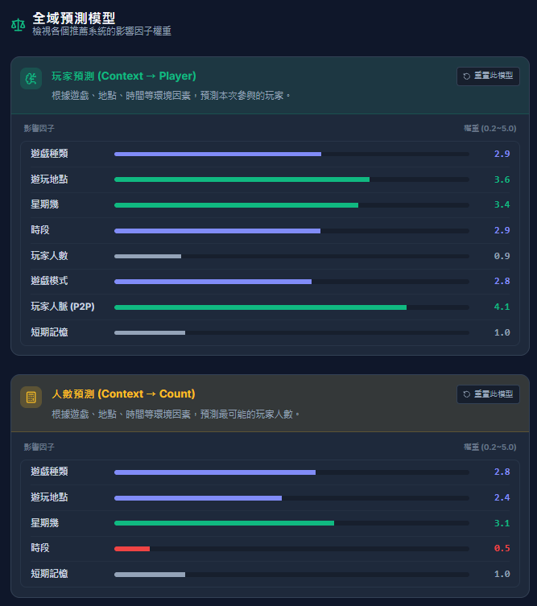

# Main 預測模型基準

這是 merge `V3test` 前，從 `main` 版本截取的同一位使用者預測模型參數，供 merge 後回歸比較。

## 玩家預測（Context → Player）

| 影響因子 | 權重 |
| --- | ---: |
| 遊戲種類 | 2.9 |
| 遊玩地點 | 3.6 |
| 星期幾 | 3.4 |
| 時段 | 2.9 |
| 玩家人數 | 0.9 |
| 遊戲模式 | 2.8 |
| 玩家數 (P2P) | 4.1 |
| 短期記憶 | 1.0 |

## 人數預測（Context → Count）

| 影響因子 | 權重 |
| --- | ---: |
| 遊戲種類 | 2.8 |
| 遊玩地點 | 2.4 |
| 星期幾 | 3.1 |
| 時段 | 0.5 |
| 短期記憶 | 1.0 |
